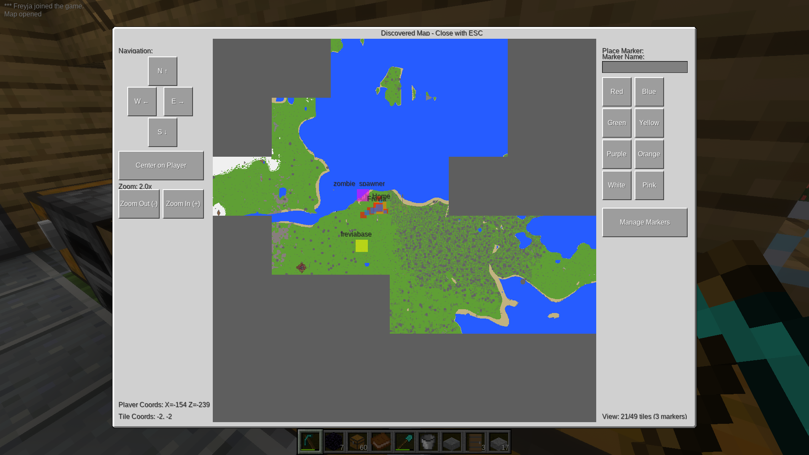
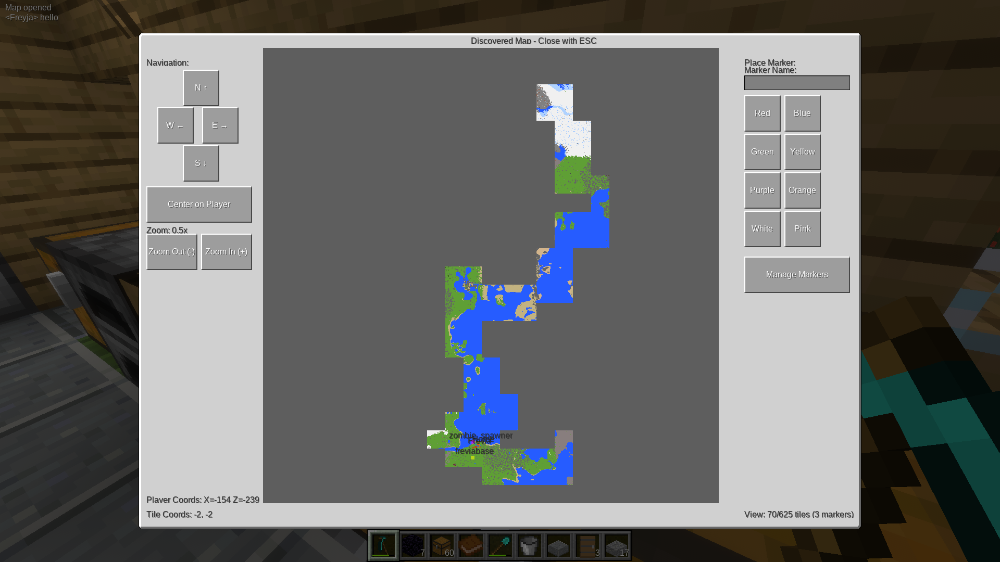
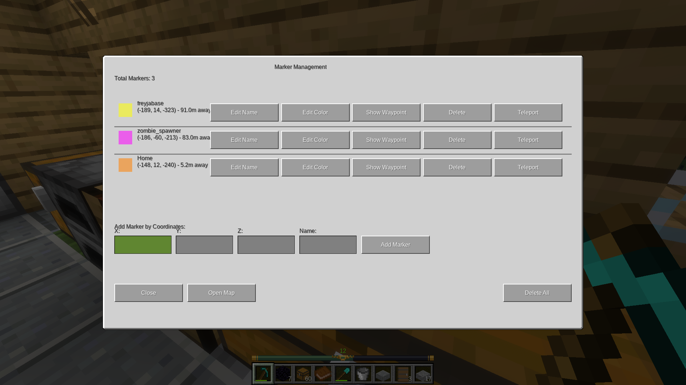
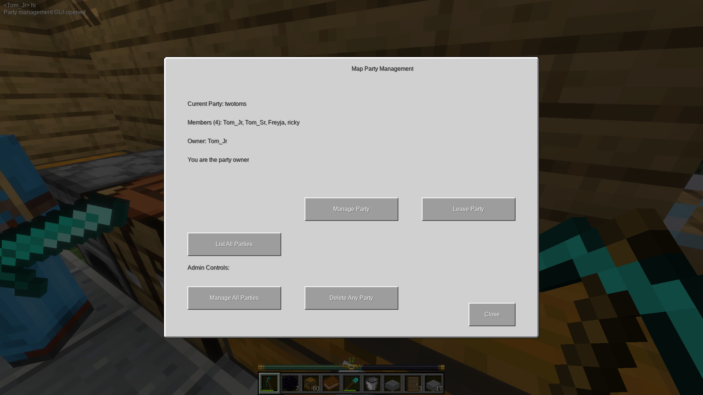

# discovery_maps

adds fullscreen mapping, markers, and multiplayer team map sharing system to luanti

## Hashimon controls

- **Arrow keys** pan the map while `/map` is open (1 tile per press). Left/right arrows require the Hashimon Luanti client build (formspec key patch).
- **`/map full`** or the **Ver todo descubierto** button zooms out to show all discovered tiles (auto 0.25x/0.125x zoom for large exploration).
- Click the map area if arrow keys do not respond (text fields capture focus).

Chart your world your way with a fully featured fullscreen map!

Visible markers with easy teleport (if you have permissions!)

Discover the world with your friends!

